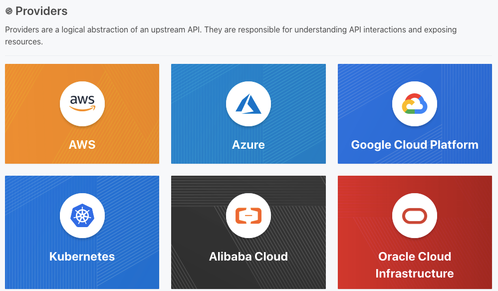

#### Terraform providers

https://medium.com/@lawrieden/top-5-terraform-providers-fbd6338bec8d



#### CDK for Terraform Documentation
https://developer.hashicorp.com/terraform/cdktf

#### CDK for Terraform Github Repo
https://github.com/hashicorp/terraform-cdk

#### CDKTF API Reference to help you understand how the CDK constructs work.
https://developer.hashicorp.com/terraform/cdktf/api-reference/typescript

#### Examples of CDK for Terraform (CDKTF) applications.
https://developer.hashicorp.com/terraform/cdktf/examples-and-guides/examples


# CLI Configuration
The CDK for Terraform (CDKTF) CLI allows you to initialize a new CDKTF project, adjust project settings, synthesize your infrastructure into Terraform configuration files, deploy your CDKTF application, and more. You can also use some Terraform CLI commands like terraform apply and terraform destroy directly, but we recommend using the available cdktf cli commands

### Install

```bash
npm install -g cdktf-cli
```


### Use

```bash
cdktf --help
```


#### Commands
cdktf --help
cdktf version
# I will use store state remotely
cdktf init --template=typescript 

cdktf init --template=typescript --local 
###### --local inform cdktf that we like to store the state of the infrastructure locally, so their a option to store the state of infrastruture remotely 

npm i @cdktf/provider-aws
<!-- cdktf provider add "hashicorp/aws" -->

<!-- cdktf get -->
cdktf synth    
cdktf synth --help 
cdktf plan
cdktf deploy
cdktf deploy --help
cdktf destroy